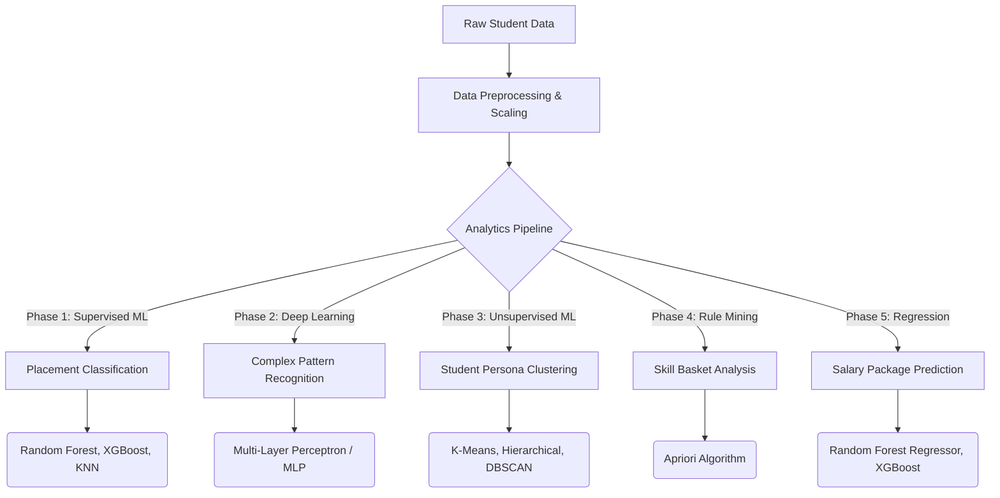

# Student Placement and Salary Analytics Pipeline

## Problem Statement

Educational institutions often lack data-driven frameworks to accurately predict student placement outcomes, identify skill gaps, and forecast expected salary packages. This project builds a comprehensive ML pipeline that predicts placement status, categorizes student personas, extracts employability rules, and estimates final salary packages in LPA.

---

## Pipeline Diagram



---

## Dataset Details

Datasets are automatically sourced via the `kagglehub` library.

| Dataset | Source | Description |
|---|---|---|
| Classification | `sahilislam007/college-student-placement-factors-dataset` | 10,000 records — CGPA, internships, projects, communication skills, placement status |
| Regression | `muhamedumarjamil/student-placement-data-with-cgpa-and-salary` | Academic metrics mapped to final salary packages (LPA) |
| Supplementary | `devildyno/computer-science-students-career-prediction` | Career prediction and peer skill comparisons |
| Supplementary | `wsj/college-salaries` | Dashboarding and salary benchmarking |

---

## Models Used

### Classification (Supervised ML)
- Random Forest Classifier
- XGBoost Classifier
- K-Nearest Neighbors (KNN)

### Deep Learning
- Multi-Layer Perceptron (MLP) — Architecture: `64 → 32 → 16` hidden neurons

### Clustering (Unsupervised ML)
- K-Means Clustering
- Agglomerative (Hierarchical) Clustering
- DBSCAN — for outlier/noise detection

### Association Rule Mining
- Apriori Algorithm — extracts high-confidence "If-Then" employability rules

### Regression
- Linear Regression
- Random Forest Regressor
- XGBoost Regressor

---

## Dependencies

```bash
pip install pandas numpy scikit-learn xgboost mlxtend matplotlib seaborn kagglehub
```

---

## How to Run

1. **Clone the repository**
```bash
git clone https://github.com/barath37/placement-prediction.git
cd placement-prediction
```

2. **Install dependencies**
```bash
pip install pandas numpy scikit-learn xgboost mlxtend matplotlib seaborn kagglehub
```

3. **Launch Jupyter Notebook**
```bash
jupyter notebook placement_prediction.ipynb
```

4. **Run all cells**
   Open the notebook and select `Cell > Run All`. The notebook will automatically download datasets, preprocess data, train all models, and output metrics and visualizations sequentially.

---

## Sample Output

| Output | Preview |
|---|---|
| Neural Network Confusion Matrix |  |
| Student Clustering Personas (K-Means) |  |
| Association Rules (Support vs Confidence) |  |

---

## Team

| Name | Roll Number | Institution |
|---|---|---|
| Barath Kumar S | 24BIT011 | Kumaraguru College of Technology (KCT) |

---
